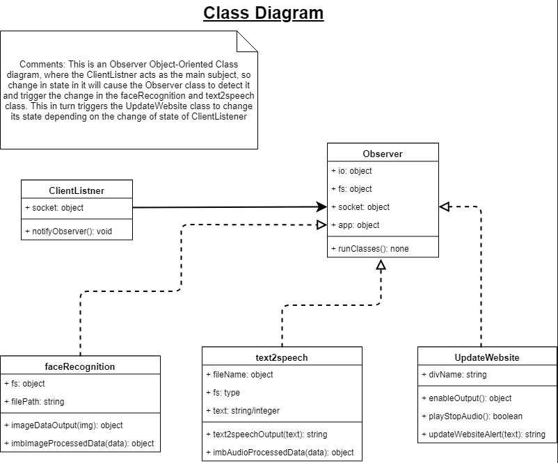
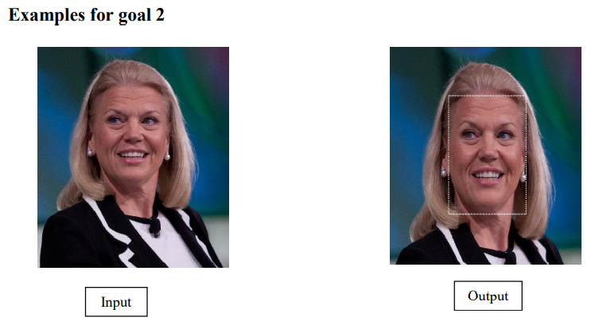
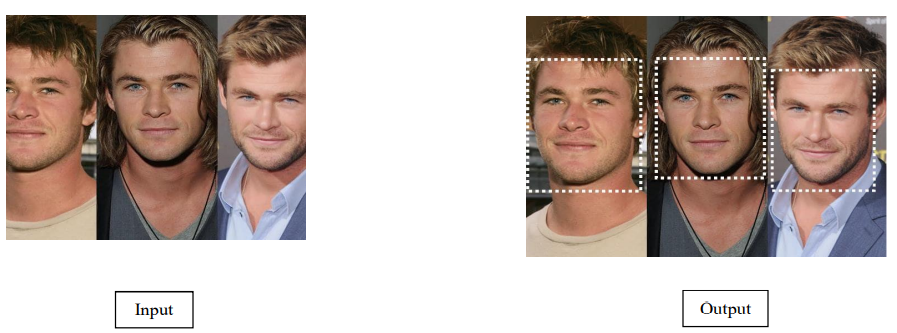

### Depreciation Notice

- IBM has depreciated Visual Recognition, hence there is no video showing the way
  this server functions. It is advised not to use this code, though, part of it can 
  be reused. All the API keys are no longer functional.

# IBM Cloud Watson Facial Image Analysis Using Cloud Services (Facial Recognition + Text to Speech)

In this project, server takes as input an image which is uploaded by a client through a user-friendly webpage. The server then uses a machine learning techniques (IBM Watson Cloud) to get data about the faces in the uploaded image and send it back to the client. Data received from IBM Cloud server includes number of faces detected on the image, an average age, and a gender of a person on the image. After that the system converts the data into a line of text, which then is passed back to the IBM Cloud's text-to-speech conversion algorithm. IBM Cloud returns the audio file back to the server allowing the user can play the audio from the webpage.

## System Architecture

- Added uploader to allow users upload images to our server
- Added a user-friendly UI
- Added UI animations
- Enabled communication with IBM Cloud via API Keys
- Server sends the image to IBM Cloud
- Server receives processed data from IBM Cloud (number of faces, min/max age, gender)
- Server converts min/max age to average age
- Server converts number of faces, min/max age, and gender to a line of text
- Server sends the line of text to the IBM Cloud's speech-to-text conversion algorithm
- Server receives the audio file from the IBM Cloud
- Server draws the rectangular box around all the faces
- Server displays converted line of text with the information about the number of people,  number of faces, average age, and a gender
- Server displays the original image, and the image with rectangular shape around each face
- Server displays the play/stop audio button

## Languages & Libraries

- Languages: HTML, CSS, JavaScript 
- ExpressJS, SocketIO, SocketIO-Stream, SocketIO-File-Upload, Watson-Developer-Cloud

## Class Diagram



## Examples 





## Installation

1. Install node.js
2. Run ```npm install```
3. Run ```node server.js```
4. Access via the url: http://localhost:3000

